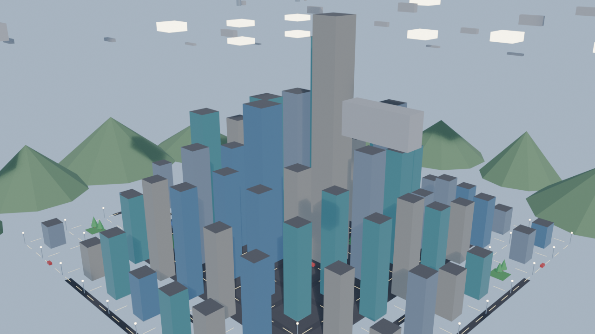

# models

3D models built and maintained in Blender.

## City landscape

A **modern-downtown** city scene for Blender 5.x: a grid of glass skyscrapers
with a distance-based height falloff (tall core, shorter edges), green park lots,
daytime lighting, and an aerial camera.

### What's in the scene

- **Buildings** — glass towers (four tints: blue, teal, steel, warm) on a grid.
  Footprints scale with height so the tall core reads as solid mass rather than
  needles, and each tower is capped with a dark mechanical rooftop.
- **Rooftop detail** — AC/utility boxes, water tanks, antenna masts, and crowning
  spires on the tallest towers (all parented to their building).
- **Streets** — an asphalt road grid with dashed lane markings, sidewalk slabs
  under each block, street lamps at every intersection, and scattered parked cars.
- **Greenery** — park lots planted with clusters of trees (trunk + conifer foliage).
- **Environment** — a river running through the city with a bridge deck, and a
  ring of distant hills around the skyline for depth.
- **Time of day** — a daytime sky with a warm sun. Switch the world background and
  sun energy down for a night scene where windows and lamps glow.

### Files

| File | Purpose |
|------|---------|
| `city.blend` | The editable scene — open in Blender to view or edit by hand |
| `city_preview.png` | 1280×720 preview render |
| `exports/city.glb` | glTF export for game engines / web viewers |
| `exports/city.fbx` | FBX export for DCC tools |

### Working with the scene

Open `city.blend` in Blender and edit directly. The scene is organized by
name prefix so objects are easy to select in bulk:

| Prefix | Objects |
|--------|---------|
| `Bldg_*` | building towers (rooftop detail + windows parented underneath) |
| `Roof_*` | rooftop AC boxes, tanks, antennas, spires |
| `Road*` / `Paint*` | road grid and lane markings |
| `Walk_*` / `Lamp_*` / `Pole_*` | sidewalks and street lamps |
| `Tree_*` / `Park_*` | greenery |
| `Hill_*` / `River` / `Bridge` | environment |

To re-export after edits, use **File ▸ Export ▸ glTF 2.0 / FBX** and overwrite the
files in `exports/`.
